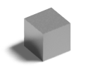

# Farm Foreman

Maya animation rendering made faster and easier.

[Download](https://github.com/lucaspetter/farm-foreman/releases/latest)

## About Farm Foreman
Farm Foreman is a Windows batch script for render farming Autodesk Maya 3D animation. It automates the rendering across multiple networked computers, saving significant amounts of time in getting large projects done. It's also a great alternative to expensive commercial render farming software.

## Helpful features

### Time saver
Whether running on just a few computers or several dozen, Farm Foreman slices an animation's render time down to a manageable size. For instance, a task that might normally take a month and a half on a single computer can finish in under 24 hours on 40 computers. More worker computers can be "hired" to the team at any point to speed up the process.

### Smart workers
Rather than dividing an animation into sets of frames for each worker computer to render on its own, Farm Foreman workers act as a team to finish the job together reliably and quickly. They run in parallel, each one rendering a single frame at a time, continually aware of which frames the others are currently processing, and moving on to the next available frame when ready. This ensures all workers keep processing until the very end and no frame is rendered twice.

### Automated recovery
If a computer shuts down unexpectedly or crashes, the others will continue where it left off, making the most of available time and resources. Once they've rendered the last frame, Farm Foreman workers automatically go back and check over each other's work, leaving no missing or unfinished frames behind.

### Queuing system
When a job is done, Farm Foreman doesn't quit, it moves on to the next one in the queue. Once all the jobs are finished, it remains idle until more are added. This allows for multiple animation projects to be rendered, including multiple camera angles within projects. Farm Foreman even uploads all the rendered frames to an FTP server for remote access and sends a notification email upon finishing each job.

## Render statistics
Film | [Hawaiian Sunset][1] | [Tiny Bathroom][2] | [Popcorn][3]
---- | -------------------- | ------------------ | ------------
*Frames* | 3687 | 450 | 800
*Average render time per frame* | 7.5 minutes | 22 minutes | 12 minutes
*Worker computers* | 49 (all with 8 threads) | 68 (all with 8 threads) | 52 (all with 8 threads)
*A single computer would have taken* | Over 19 days | Over 7 days | Over 6 days
*Rendered with Farm Foreman in* | 9 hours, 24 minutes | 2 hours, 26 minutes | 3 hours, 5 minutes
[1]: https://www.lucaspetter.com/films/hawaiian-sunset/
[2]: https://www.lucaspetter.com/films/tiny-bathroom/
[3]: https://www.lucaspetter.com/films/popcorn/

## Requirements
Farm Foreman requires two or more worker computers on the same local network with Windows 7 or later. Also required is a network-accessible storage drive attached to a non-worker computer; this acts as central storage for the project files, queued jobs, render logs, and output frames. You should also be somewhat comfortable with the Windows command line or batch scripting. Farm Foreman is built for Autodesk Maya 2012, but should work on later versions too.

## How to use it
1. Open the FarmForeman.bat script and customize it to your own needs. At a minimum, you'll need to change these things:
   - The network drive location, username, and password.
   - The path to Maya's `bin` folder on the workers (must be in the same location on each worker).
   - The path to Maya's `Render` executable on the workers (must be in the same location on each worker).
   - The number of processor threads available on the workers (must be the same number on each worker or the lowest common number). If your processors support [hyper-threading](https://en.wikipedia.org/wiki/Hyper-threading), then they'll have twice as many threads as cores; for example, a quad-core processor would have 8 threads and you'd specify `-mr:rt 8` in the script.
   - The FTP server, username, and password for uploading completed job output files.
   - The SMTP server for sending notification emails when jobs are complete. Depending on how restrictive the server is, you may need additional parameters, such as a particular From email address that the server will allow.
2. Put the Farm Foreman program folder onto the network drive.
3. Put your Maya project folder onto the network drive. Open the Maya scene file from there and do a test render to verify that it works in the new location.
4. Put a text file containing the specifications for your render job into Farm Foreman's JobQueue folder on the network drive. See the example file in the JobQueue folder for info about the proper syntax and file naming.
5. Run FarmForeman.bat from the network drive on each of the workers. They will begin rendering and you can see their progress in real-time by opening the log file in the JobLogs folder.
6. To queue additional render jobs, just add the project folders to the network drive, test them, and put new job text files in the JobQueue folder. The workers will detect the jobs and begin rendering when they're ready.

## Licence
Farm Foreman is copyright © 2012 Lucas Bleackley Petter.

Farm Foreman is free software: you can redistribute it and/or modify it under the terms of the [GNU General Public License](https://www.gnu.org/licenses/gpl.html) as published by the Free Software Foundation, either version 3 of the License, or (at your option) any later version.

Farm Foreman is distributed in the hope that it will be useful, but WITHOUT ANY WARRANTY; without even the implied warranty of MERCHANTABILITY or FITNESS FOR A PARTICULAR PURPOSE. See the GNU General Public License for more details.

Credit to third-party software used in Farm Foreman:
- [Blat](http://www.blat.net/) is in the [public domain](http://www.blat.net/?docs/license.txt).
- [Curl](http://curl.haxx.se/) is copyright © 1996-2012 Daniel Stenberg, licenced under a modified [MIT License](http://curl.haxx.se/docs/copyright.html).
- [md5deep/hashdeep](http://md5deep.sourceforge.net/) is in the public domain, made by Jesse Kornblum and Simson Garfinkel, with some code licenced under the [GNU GPL 2.0](https://github.com/jessek/hashdeep/blob/master/COPYING) licence.
- Zip/UnZip are copyright © 1990-2006 [Info-ZIP](http://www.info-zip.org/), licenced under the [Info-ZIP License](http://www.info-zip.org/license.html).
